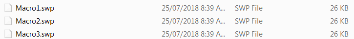
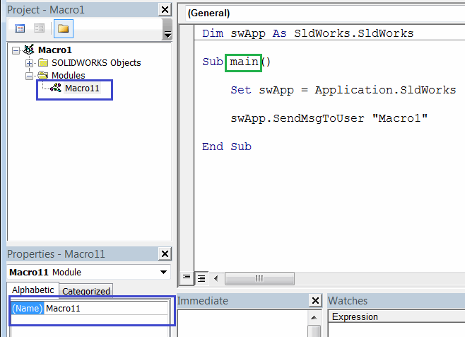
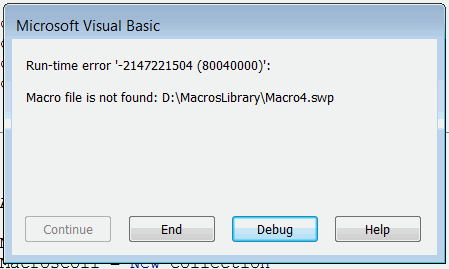
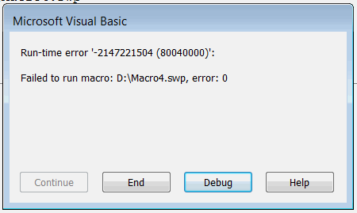

Macro can be run from another macro using the [ISldWorks::RunMacro2](http://help.solidworks.com/2010/english/api/sldworksapi/solidworks.interop.sldworks~solidworks.interop.sldworks.isldworks~runmacro2.html) SOLIDWORKS API function.

This enables the possibility to run multiple macros from within one macro. This can be useful when [adding the custom macro buttons on the macro toolbar](/solidworks-api/getting-started/macros/macro-buttons/) so multiple commands can be executed by one button click.

The following example allows to run several SOLIDWORKS macros within one macro.



Change the arguments of **RunMacro** call to call your own group of macros.

~~~ vb
RunMacro "Full Path To Macro", "Module Name", "Entry Function Name"
~~~

Where

{ width=350 }

* **Full Path To Macro** - full path to .swp or .dll for [VBA or VSTA macro](/solidworks-api/getting-started/macros/types)
* **Module Name** - name of the module where the main entry function is defined. This is usually the macro name followed by 1.
* **Entry Function Name** - name of the entry function. This function cannot have parameters. Usually named **main**

> Modify the macro as per your needs. You can add remove the calls to **RunMacro** and change path, module and function names to match the path to the macro in the library

The following macro provides more advanced functionality of running the macro. It allows to specify the multiple comma separated macros as well as folders using the full path or relative path.

This enables better experience when maintaining the macro.

This macro also handles the errors:

* When the specified macro path is not found:

{ width=250 }

* When macro cannot be run (e.g. macro is corrupted)

{ width=250 }

In order to configure the macro it is required to modify the value of the **MACROS_PATH** variable:

* It is possible to specify multiple macros to run by separating them by comma, e.g. **Macro1.swp, Macro2.swp**
* Macro can be specified with a full path (e.g. **D:\Macros\Macro1.swp**) or using relative path (e.g. **Macro1.swp**). If later the macro must be available in the same folder as this master macro
* It is possible to specify the folder of macros to run (e.g. **D:\Macros** or **Macros**). Same as macro path either full path or relative folder path are accepted. In this case all macros from the specified folder will be run
* If empty string is specified, i.e. 

~~~ vb
Const MACROS_PATH As String = " "
~~~

All macros of the folder where this master macro is placed will be run. This option is useful as it is only required to copy the master macro to the location of the macro library to run without the need to modify it.


