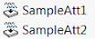

Attributes are special features which can be inserted via [IAttributeDef::CreateInstance5](https://help.solidworks.com/2012/english/api/sldworksapi/solidworks.interop.sldworks~solidworks.interop.sldworks.iattributedef~createinstance5.html) SOLIDWORKS API method. Although attributes are native features available and visible (optionally) in the Feature Manager Tree, they cannot be inserted or edited (only deleted) via regular user interface and only accessible via API.

Attribute instance is created from the attribute definition. Software which will be utilizing attribute should define its definition via [ISldWorks::DefineAttribute](https://help.solidworks.com/2012/english/api/sldworksapi/solidworks.interop.sldworks~solidworks.interop.sldworks.isldworks~defineattribute.html) SOLIDWORKS API method.

### Notes

* Attributes can be associated with an selectable object (body, component, face, edge, vertex, loop or feature)
* Attributes can store parameters
* Attributes can be hidden in the Feature Tree

Refer the examples from under the **Attributes** section for more information about usage of attributes.
