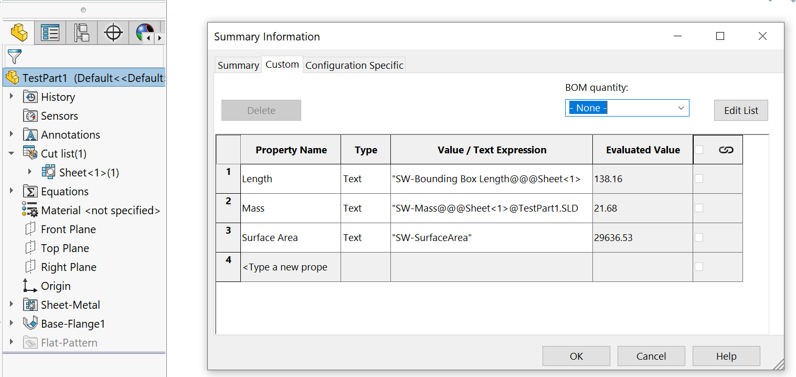

{ width=800 }

This VBA macro allows to link specified cut-list custom properties from sheet metal parts to the custom properties of the SOLIDWORKS file.

Custom properties will be linked by formula and will be automatically updated if the geometry of sheet metal is changed.

It is possible to specify a fallback value which will be written to custom property if the source part is not a sheet metal document.

In order to customize the properties map, add remove the map values within the **Init** function as shown below.

When specifying expressions in the last parameter (**fallback value**) it is required to escape the **"** (quote) with other **"** (quote). For example formula for SOLIDWORKS mass is **"SW-Mass"** if this needs to be set as the fallback value, the third parameter should be **"""SW-Mass"""** where the outer quotes are quotes indicating the [VBA string value](/visual-basic/variables/standard-types#string)

~~~ vb
Sub Init(Optional dummy As Variant = Empty)
    
    Set Map = New Collection
    
    Map.Add CreateMapValue("Part Number", "", "") 'Add empty 'Part Number' custom property
    Map.Add CreateMapValue("Width", "Bounding Box Width", "") 'Add custom property 'Width' from the 'Bounding Box Width' of the sheet metal or empty if not sheet metal part
    Map.Add CreateMapValue("Material", "", """SW-Material""") 'Add custom property 'Material' and set to the 'SW-Material' formula regardless if this is a sheet metal part or not
        
End Sub
~~~

## Notes And Limitations

* Only single cut-list files are supported (error is thrown if more than one cut list is available)
* Macro will set **Create Cut List Automatically** and **Updated Automatically** options on the cut-list folders
* Only part documents are supported
* Cut-list custom properties are linked by expressions and cut-list name. If cut-list is renamed property will not be updated and it will be required to rerun the macro. However should the cut-list keep the original name all properties will be dynamically updated without the need to rerun the macro.

