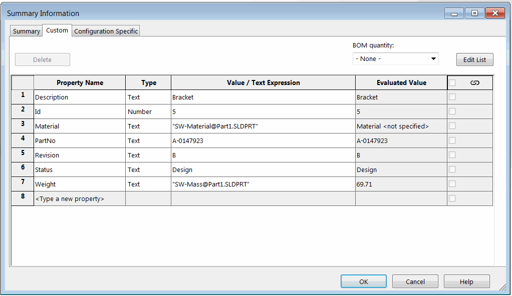

{ width=350 }

This VBA macro sorts the custom properties in a file and all configurations using the logical order with SOLIDWORKS API. Both ascending and descending order can be specified.

Logical order sorts the element as follows. This is an order of files being ordered in Windows File Explorer

* Property1
* Property2
* Property3
* Property12
* Property20
* Property21
* Property30

While alphabetical sort for the above sequence would produce the following result:

* Property1
* Property12
* Property2
* Property20
* Property21
* Property3
* Property30

## Configuration

Macro can be configured by changing the constant values in the macro as follows:

~~~ vb
Const ASCENDING As Boolean = True 'True to sort ascending, False to sort descending
Const REORDER_GENERAL_CUST_PRPS As Boolean = True 'True to sort file specific custom properties, False to skip
Const REORDER_CONF_CUST_PRPS As Boolean = True 'True to sort configuration specific custom properties (for parts and assemblies), False to skip
~~~


