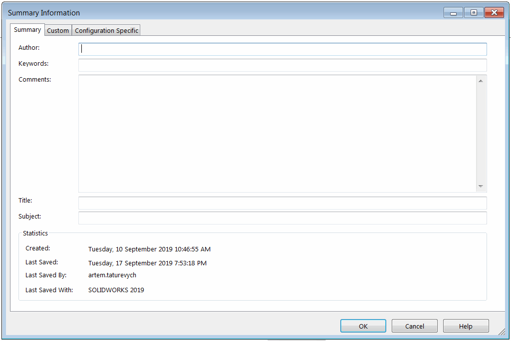

This VBA macro fills the *Summary Information* tab (author, keywords, comments, title and subject) of custom properties of active model using SOLIDWORKS API.

Configure the macro and specify the values to write:

~~~ vb
Const AUTHOR As String = "CodeStack"
Const KEYWORDS As String = "sample,summary,api"
Const COMMENTS As String = "Example comments"
Const TITLE As String = "Summary API Example"
Const SUBJECT As String = "CodeStack API Examples"
~~~


