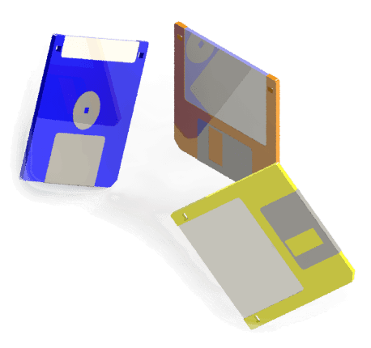

{ height=250 }

This section contains guides and examples of deploying add-ins, macros and stand-alone applications for SOLIDWORKS to the user machines.

Deployment can be done [manually](manual). In this case all the binaries and registration process needs to done manually or via command line scripts.

Deploying via [msi-installer](installer) allows better user experience as clients will be guided through the installation process. Furthermore the process of upgrade and uninstall is controlled by the Windows Control panel.
