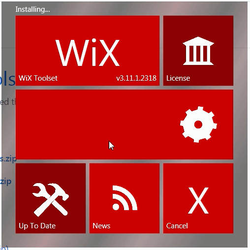
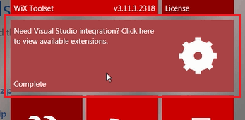
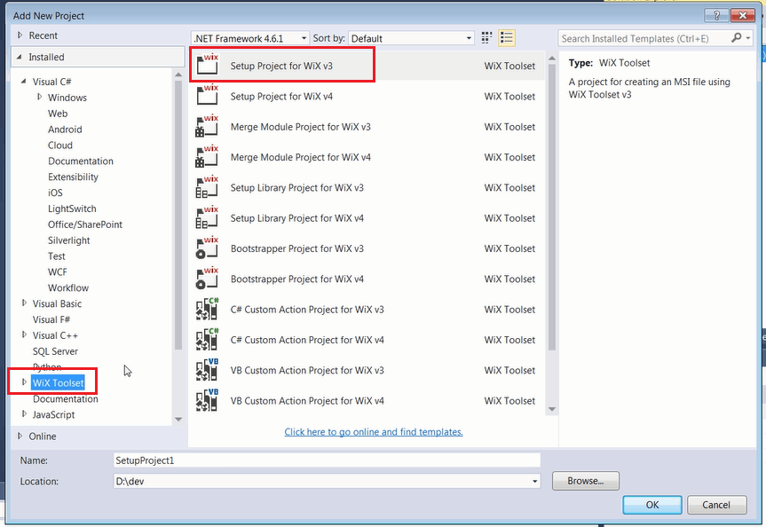
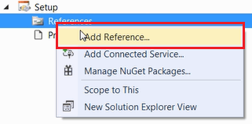
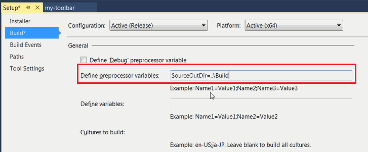
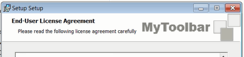
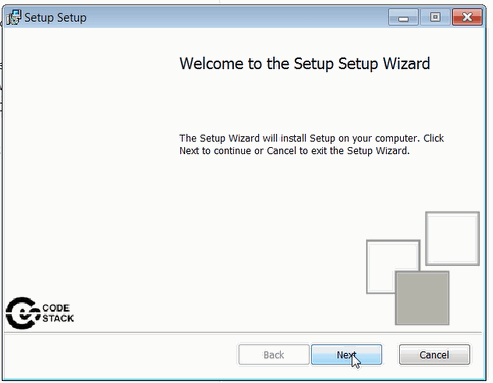
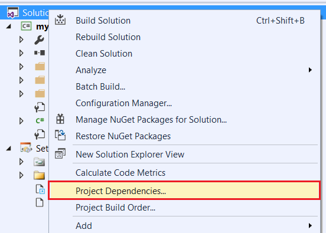
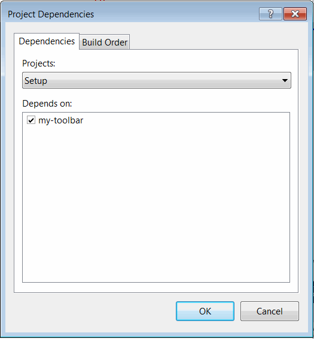
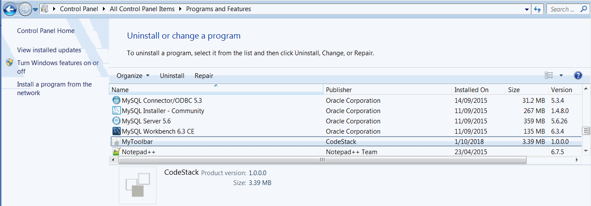



## Downloading and installing WiX framework

Download the WiX installer from the [WiX Toolset](http://wixtoolset.org/) website

> It is recommended to download the latest stable version

Run the installation process

{ width=250 }

Once installation is complete click the button to install the Visual Studio extension

{ width=250 }

> Alternatively extensions can be downloaded directly from the [Releases Page](http://wixtoolset.org/releases/) or from [Visual Studio Marketplace](https://marketplace.visualstudio.com/items?itemName=RobMensching.WiXToolset)

## Adding the installer project

Once WiX framework and Visual Studio extension are installed setup project can be created and compiled directly from the Visual Studio.

Add new project and select *Setup Project for WiX vX* under the *WiX Toolset* category

{ width=350 }

Visual Studio will generate the default project.

## Configuring the project

Follow the steps below to configure the project

### Add extension references 

Add the reference for WiX extension to use standard pages in installer dialog by clicking the *Add Reference...* command from the context menu

Browse to *WixUIExtension.dll* and *WixUtilExtension.dll* files located at %wix%\bin

### Adding the x64 configuration

By default WiX project is created for x86 deployment. Majority of SOLIDWORKS versions are x64. So it is required to modify the WiX project to support this environment.

Unload the Setup project in Visual Studio and click *Edit Project* or open the *.wixproj file in any text editor. Modify property group to support x64 environment as shown on the picture below:

### Setting the build folder as a preprocessor variable

For the purpose of simplification of linking of files into the setup project it is recommended to create a preprocessor variable in the WiX project which is equal to the build location of the add-in

> SourceOutDir=..\Build

{ width=350 }

> It is allowed and recommended to use relative path to point to the build location

## Configuring the product

*Product.wxs* is the file which contains the configuration of the installer package

### Adding the default dialogs

To add the minimal dialogs (i.e. welcome page, installation folder and progress) it is required to add the following lines within the *Package* node

~~~ xml
<UIRef Id="WixUI_InstallDir" />
<UIRef Id="WixUI_Common" />
<Property Id="WIXUI_INSTALLDIR" Value="INSTALLFOLDER" />
~~~

### Adding the attribution

It is possible to customize the dialog to include icons and banner images

Banner is an image displayed in the header of the installer. This should be a .bmp file with size of 493x58 pixels.

Dialog background is an image displayed in the background of the installer. This should be a .bmp file with size of 493x312 pixels.

{ width=350 }

Icon can be added as an .ico file and will be assigned to the product in the *Programs and Features* group in *Control Panel*.

The following lines needs to be added within the *Package* node to add the references to the attribution files:

~~~ xml
<Icon Id="MainIconId" SourceFile="Resources\icon.ico"/>
<Property Id="ARPPRODUCTICON" Value="MainIconId" />
<WixVariable Id="WixUIBannerBmp" Value="Resources\banner.bmp" />
<WixVariable Id="WixUIDialogBmp" Value="Resources\dialog.bmp" />
~~~

### Adding End User License Agreement (EULA)

EULA page can be added to the installer by adding the following line within the *Package* node. Package won't be installed until user agrees on the EULA terms and conditions. EULA must be provided in the Rich Text Format (*.rtf)

~~~ xml
<WixVariable Id="WixUILicenseRtf" Value="Resources\eula.rtf" />
~~~

### Adding add-in registry component group

Add registry component into the **ComponentGroup** node to add registry key for the add-in

~~~ xml
<Component Id="Reg" Guid="{NEW GUID}">
    <RegistryValue Root="HKCU" Key="Software\SolidWorks\AddInsStartup\{ADDIN GUID}" Value="1" Type="integer" Action="write" />
    <RegistryValue Root="HKLM" Key="Software\SolidWorks\Addins\{ADDIN GUID}" Value="0" Type="integer" Action="write" />
    <RegistryValue Root="HKLM" Key="Software\SolidWorks\Addins\{ADDIN GUID}" Name="Description" Value="AddIn description" Type="string" Action="write" />
    <RegistryValue Root="HKLM" Key="Software\SolidWorks\Addins\{ADDIN GUID}" Name="Title" Value="AddIn Title" Type="string" Action="write" />
</Component>
~~~

### Adding files

#### Adding the group for SOLIDWORKS interops

Add the SOLIDWORKS interops to be added to the installer by adding the following component into the **ComponentGroup** node

~~~ xml
<Component Id="interops" Guid="{NEW GUID}">
    <File Id='SolidWorks.Interop.sldworks.dllID' Name='SolidWorks.Interop.sldworks.dll' Source ='$(var.SourceOutDir)\SolidWorks.Interop.sldworks.dll'/>
    <File Id='SolidWorks.Interop.swconst.dllID' Name='SolidWorks.Interop.swconst.dll' Source ='$(var.SourceOutDir)\SolidWorks.Interop.swconst.dll'/>
    <File Id='SolidWorks.Interop.swpublished.dllID' Name='SolidWorks.Interop.swpublished.dll' Source ='$(var.SourceOutDir)\SolidWorks.Interop.swpublished.dll'/>
    <File Id='SolidWorksTools.dllID' Name='SolidWorksTools.dll' Source ='$(var.SourceOutDir)\SolidWorksTools.dll'/>
</Component>
~~~

> $(var.SourceOutDir) variable will be resolved to the build folder defined in [Setting the build folder as a preprocessor variable](#setting-the-build-folder-as-a-preprocessor-variable)

#### Adding another files to the installer

If it is required to include any other data or dll files to the installer add another component with files under the **ComponentGroup** node

~~~ xml
<Component Id="files" Guid="{NEW GUID}">
    <File Id='{FileName}ID' Name='{FileName}' Source ='$(var.SourceOutDir)\{FileName}'/>
    ....
</Component>
~~~

#### Automatically add project files

Alternatively files can be added automatically using the harvest tool so it is not required to manually add each file one-by one. Add the following snippet into the *.wixproj file

~~~ xml
<Target Name="BeforeBuild">
<HeatDirectory Directory="..\Build" Transforms="DirectoryHeatTransform.xslt" PreprocessorVariable="var.SourceOutDir" OutputFile="Files.wxs" ComponentGroupName="FilesRegGroup" DirectoryRefId="INSTALLFOLDER" AutogenerateGuids="true" ToolPath="$(WixToolPath)" SuppressFragments="true" SuppressRegistry="true" SuppressCom="true" SuppressRootDirectory="true" />
</Target>
~~~

*Transforms* property allows to define the xslt transformation to exclude any files (e.g. pdb or xml) which are not required to be a part of the installer:



## Registering COM components

> If stand-alone application needs to be deployed and no COM components needs to be registered than this step could be skipped.

SOLIDWORKS add-in must be registered as a COM component. It is recommended to use [Harvest tool (heat)](http://wixtoolset.org/documentation/manual/v3/overview/heat.html) instead of custom action with [regasm](https://docs.microsoft.com/en-us/dotnet/framework/tools/regasm-exe-assembly-registration-tool) to deploy COM components

Harvest tool can be used in 2 approaches

### Approach A: post build action

Add the following line into the post action build event for the projects which requires COM components to be registered

~~~ cs
"%WIX%\bin\heat.exe" file "$(TargetPath)" -ag -srd -cg "AddInComRegGroup" -var var.SourceOutDir -dr INSTALLFOLDER -o "..\Setup\AddInReg.wxs"
~~~

### Approach B: BeforeBuild Target

Add the following snippet directly to *.wixprojfile

~~~ xml
<Target Name="BeforeBuild">
    <HeatFile File="..\Build\CodeStack.Sw.MyToolbar.dll" PreprocessorVariable="var.SourceOutDir" OutputFile="..\Setup\AddInReg.wxs" ComponentGroupName="AddInComRegGroup" DirectoryRefId="INSTALLFOLDER" AutogenerateGuids="true" ToolPath="$(WixToolPath)" SuppressFragments="false" SuppressRegistry="false" SuppressCom="false" SuppressRootDirectory="true" />
</Target>
~~~

This action will create an *AddInReg.wxs* with *AddInComRegGroup* component file with all required information needed to register the COM component on a target machine. 

> It is recommended to generate this file directly to the setup project folder

Add this file into the WiX project so it gets compiled.

Add the reference to the component into the **Feature** node

~~~ xml
<ComponentGroupRef Id="AddInComRegGroup"/>
~~~

Set the **Manufacturer** attribute of the **Product** node as this is a mandatory attribute.

## Additional parameters

Modify the **MediaTemplate** node as follows

### Generating single .msi installer package

~~~ xml
<MediaTemplate EmbedCab="yes"/>
~~~

This will allow to generate a single *.msi file for setup.

### Setting the default installation folder

Modify the default installation location to link to x64 version of program files *ProgramFiles64Folder*. Optionally specify the directory for the company name:

~~~ xml
<Directory Id="TARGETDIR" Name="SourceDir">
    <Directory Id="ProgramFiles64Folder">
        <Directory Id="CodeStackDirId" Name="CodeStack">
            <Directory Id="INSTALLFOLDER" Name="MyAddIn" />
        </Directory>
    </Directory>
</Directory>
~~~

> The above will generate a default install location to be equal to %programfiles%\CodeStack\MyAddIn

### Automatically building the add-in project when installer is built

By default installer project is not dependent on other projects in solution. It is recommended to add the dependency so all projects are built before the installer project is compiled so it will ensure the latest binaries got added to the .msi package.

Select the installer project and click *Project Dependencies...*

{ width=250 }

Make sure that the installer project is selected in the drop-down and check add-in project as a *depends on* reference

{ width=250 }

Compile the installer project. This will generate an .msi package in the output folder.

Once installed add-in is added to the Programs and Features in Control Panel. The installation can be repaired or add-in can be uninstalled from this page.

{ width=350 }

## Releasing new version of the product

When new version of binaries are ready it is required to change the **Version** attribute of the **Product** node. And it is possible to upgrade the existing installation of the previous version without the need to uninstall the previous one.

> It is recommended to keep the version of the installer in sync with the assembly version of the add-in dll.

## Template example of Product.wxs file



## Example projects

* [Sketch++](https://github.com/codestackdev/sketch-plus-plus/tree/master/Installer)
* [MyToolbar](https://github.com/codestackdev/my-toolbar/tree/master/Installer)
* [Geometry++](https://github.com/codestackdev/geometry-plus-plus/tree/master/Installer)

