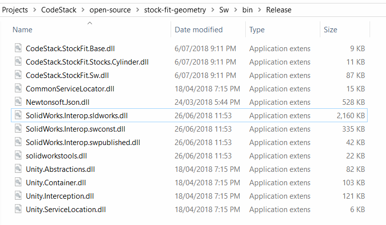
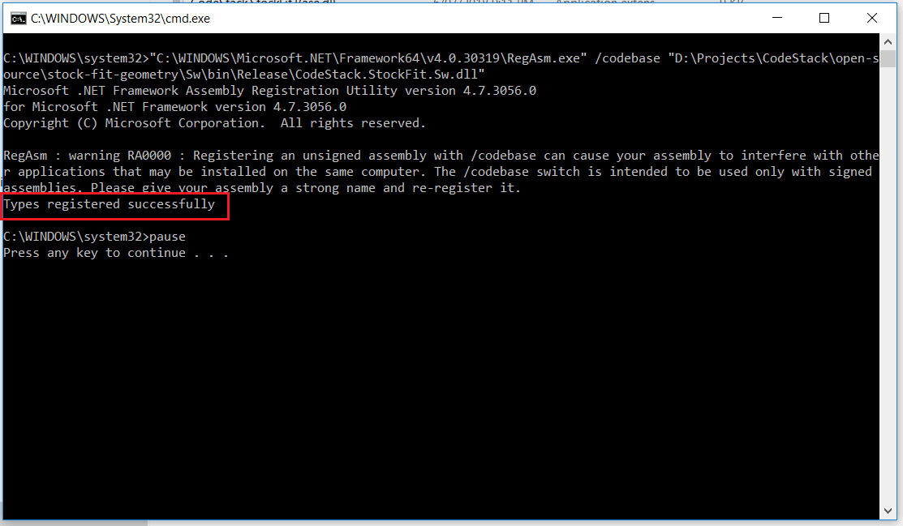
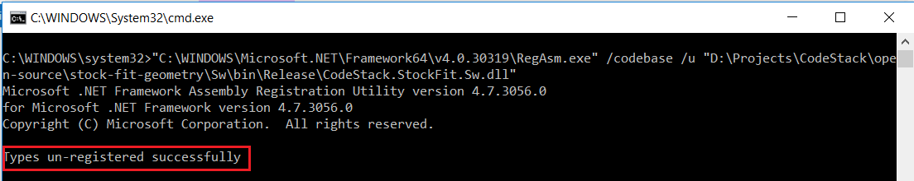

This article explains how to deploy and register SOLIDWORKS add-in manually.

### Deploying binaries

Once project is successfully compiled all required binaries and data files are placed into the output folder.

{ width=350 }

When deploying the product (add-in or stand-alone application) all files must be deployed (including any 3rd party dlls or interops). You may exclude any supporting files such as pdb-files or xml documentation files.

### Registering add-in

Copying the files to the user machine is not enough to register it on the target system. It is also required to register add-in COM object and add corresponding entries to the registry.

To register .NET add-in (C# or VB.NET) it is required to call the [Assembly Registration Tool (regasm)](https://docs.microsoft.com/en-us/dotnet/framework/tools/regasm-exe-assembly-registration-tool) with /codebase option

> "%Windir%\Microsoft.NET\Framework64\v4.0.30319\regasm" /codebase "PATH TO ADDIN DLL"

Message similar to the following should be displayed if the registration successful:

{ width=500 }

> It is required to use the correct version of the framework depending on the target framework add-in was compiled to.

To register COM add-in (C++) it is required to call the [regsvr32](https://docs.microsoft.com/en-us/windows-server/administration/windows-commands/regsvr32) utility.

> Registration usually requires running the [Command Prompt](https://en.wikipedia.org/wiki/Cmd.exe) as an administrator.

It is not required to register COM objects for stand-alone application unless it explicitly requires this.

### Adding the registry information

Information about the add-in needs to be added to the registry so SOLIDWORKS can correctly load the add-in. It is possible to create a registry file which will be adding this information to the registry.

The keys added to HKEY_LOCAL_MACHINE are mandatory and identify the add-in to be available in the add-ins list. The keys added to HKEY_CURRENT_USER are optional and represent the start-up state of the add-in. Set value to 1 to load add-in at start-up, set to 0 to not load on start-up.



The GUID used in the example above is an add-in guid set via [GuidAttribute](https://docs.microsoft.com/en-us/dotnet/api/system.runtime.interopservices.guidattribute?view=netframework-4.0) at the add-in class:

~~~ cs
[Guid("a377433e-f7cf-4a5a-9d74-b64c0c1758c2"), ComVisible(true)]
[SwAddin(Description = "Sample Addin", Title = "Sample AddIn Description", LoadAtStartup = true)]    
public class MyAddIn : ISwAddin
{
    ...
}
~~~

As an alternative option required registry keys can be added directly from the dll when it is registered as a COM object via [ComRegisterFunctionAttribute](https://docs.microsoft.com/en-us/dotnet/api/system.runtime.interopservices.comregisterfunctionattribute?view=netframework-4.0). In this case the above step is not required:



### Unregistering the add-in

To unregister the .NET add-in it is required to call the [Assembly Registration Tool (regasm)](https://docs.microsoft.com/en-us/dotnet/framework/tools/regasm-exe-assembly-registration-tool) with /u option

> "%Windir%\Microsoft.NET\Framework64\v4.0.30319\regasm" /u /codebase "PATH TO ADDIN DLL"

When add-in is unregistered the following message is displayed in the console:

{ width=500 }

To unregister the COM add-in it is required to call the [regsvr32](https://docs.microsoft.com/en-us/windows-server/administration/windows-commands/regsvr32) utility with /u flag.

To clear the registry values (unless it is done via the [ComUnregisterFunctionAttribute](https://docs.microsoft.com/en-us/dotnet/api/system.runtime.interopservices.comunregisterfunctionattribute?view=netframework-4.0)) call the following registry file:



### Best practices

Registration and unregistration commands can be placed into a single bat file to simplify the registration and unregistration process:

*Register.bat*


*Unregister.bat*


Change the name of the add-in and place these files into the bin folder and it will be only required to run this bat file on client machine.
