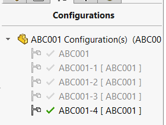
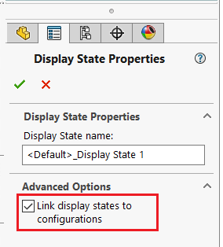

This VBA macro generates a series of configurations corresponding to the material variant of the model.

Macro will assign the name of the configuration based on the file name and specified suffix.

Macro will create a configuration specific property which is based on the file specific property and the name of the color. 

Macro will not generate new display states and assumes that the *Link display states to configuration colors* option is selected so display state is attached to the configuration.

## Configuration

Specify the name of the property to create

~~~ vb
Const PRP_NAME As String = "Description"
~~~

Configure the input parameters for the configuration by modifying the **CONFIGS_DATA** array

Set the size of the array to be equal to number of total instances - 1, e.g. 4 for 5 instances or 0 for 1 instance

~~~ vb
Dim CONFIGS_DATA(0) As ConfigData

CONFIGS_DATA(0).colorName = "MyColor"
CONFIGS_DATA(0).ConfigNameSuffix = "-9"
CONFIGS_DATA(0).MaterialFilePath = "D:\my-color.p2m"
~~~

* colorName - name of the color to be written as the suffix to the custom property
* ConfigNameSuffix - suffix name of the configuration, can be empty (in this case the configuration will be named after the file)
* MaterialFilePath - full path to the *.p2m* file to apply as appearance. If empty current appearance is preserved

Macro will create new configuration for all instances starting from second. First instance will be skipped and active configuration will be used for the process (e.g. renamed and painted).

