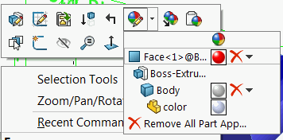

{ width=250 }

This macro removes all colors from the part document on all levels (face, feature, body) using SOLIDWORKS API.

Macro can be configured to remove the colors from all configurations or active configuration only. This option can be set by changing the value of the following constant at the beginning of the macro:

~~~ vb
Const REMOVE_FROM_ALL_CONFIGS As Boolean = True 'True to remove from all configurations, False to remove from active configuration only
~~~


