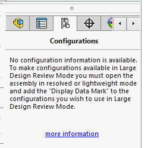
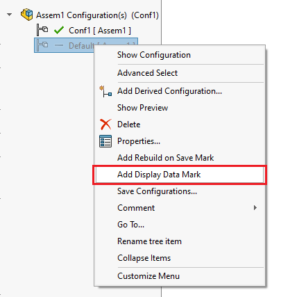

This VBA macro is useful for the users working with assemblies in the Large Design Review mode.

By default only active configuration is preserved for using the the Large Design Review mode and other configurations of the assembly cannot be activated:

This macro will traverse all components of the root assembly and find all the used configurations and add the display mark data to all of them.

This will allow to open all sub components in the Large Design Review mode and activate used configurations.

