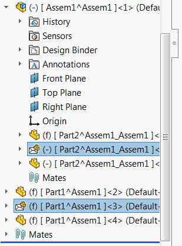

{ width=250 }

This macro is using SOLIDWORKS API to extend the available list of selection criteria in the *Advanced Selection* tool in SOLIDWORKS assembly.

Macro allows to select the following group of components (or combinations)

* Float - underconstrained components (components which have minus symbol (-) in their names)
* ExcludedFromBom - components which are excluded from Bill Of Materials (including Envelope components)
* Envelope - components which are marked as envelope
* NoMates - components which contain no mates

In order to configure the macro modify the *CRITERIA*  and *TOP_LEVEL_ONLY* constants in the beginning of the macro.

~~~ vb
Const CRITERIA As Integer = Criteria_e.Float + Criteria_e.NoMates
Const TOP_LEVEL_ONLY As Boolean = False
~~~

*TOP_LEVEL_ONLY* indicates if only top level components should be used for filtering. Set this option to *True* to select nested components as well

~~~ vb
Const TOP_LEVEL_ONLY As Boolean = True
~~~

*CRITERIA* is a combination of filters where *Or* operator is applied.

For example

~~~ vb
Const CRITERIA As Integer = Criteria_e.Float + Criteria_e.NoMates 'All float components or components with no mates wil be selected
~~~

~~~ vb
Const CRITERIA As Integer = Criteria_e.Envelope 'Only envelope components will be selected
~~~

Modify the filter in the macro as required.


