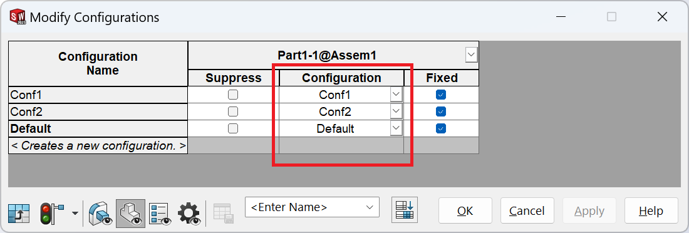

This VBA macro aligns the referenced configurations of all selected components to the corresponding assembly configuration. For example if assembly has 3 configurations **A**, **B** and **C**, then referenced configurations for all selected components will be set to **A**, **B** and **C** in the respective configuration of the assembly.

{ width=600 }

Macro processes all root configurations (or optionally all configurations)

~~~ vb
Const ROOT_CONFS_ONLY As Boolean = False 'Process all assembly configurations
~~~

Multiple components can be selected and processed at the same time. Only top level-components are supported. For aligning configurations for sub-assembly, it is required to activate the sub-assembly in its own window.

Components in the lightweight mode are supported.

