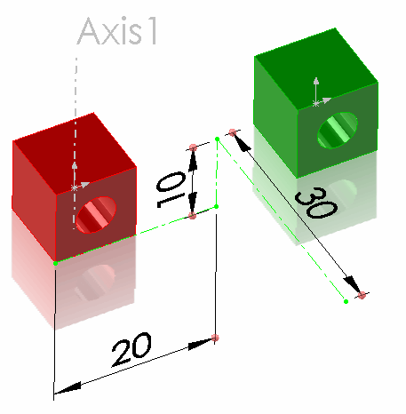
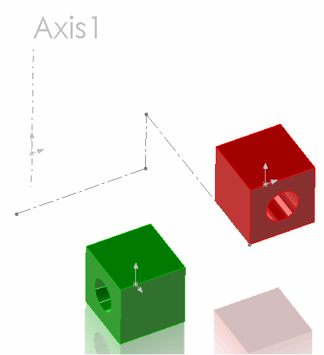

{ width=250 }

This example demonstrates how to load the transformation matrix for the components from the CSV file and apply it as a presentation transform using SOLIDWORKS API

* Download and open the [Example SOLIDWORKS Files](presentation-transform-example.zip)
* Download [CSV File](transforms.csv) and save to disc
* Modify the path to the CSV file in the macro constant
* Run the macro. Macro stops the execution and the components are transformed as shown below

{ width=250 }

Red component is translated in XYZ space and green component is rotated 90 degrees around global Y axis (Axis 1).

Please note that the components are moved regardless the fact that both of them are fully defined in space (by mates or fix constraint). And the mates are still preserved. The reason is that the presentation transform was applied instead of the permanent one. This allows to only move the components for visual purposes without changing the geometry.

Continue the macro with F5 or Play button to remove the presentation transformation. Use [IComponent2::Transform2](https://help.solidworks.com/2012/english/api/sldworksapi/SolidWorks.Interop.sldworks~SolidWorks.Interop.sldworks.IComponent2~Transform2.html) SOLIDWORKS API property instead of [IComponent2::PresentationTransform](https://help.solidworks.com/2012/english/api/sldworksapi/solidworks.interop.sldworks~solidworks.interop.sldworks.icomponent2~presentationtransform.html) to apply the permanent transform if needed (in this case it is required to remove any mates which will not fit this transformation).


