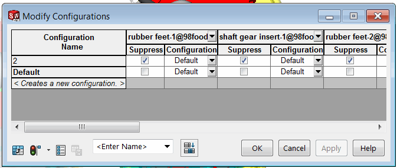

{ width=350 }

This example demonstrates how to use parameters (similar to design table parameters) to suppress all components in every configuration except of the active one using SOLIDWORKS API. It is not required to activate configuration or select any components to use the macro.

Multiple components can be modified in a batch mode to improve performance.

