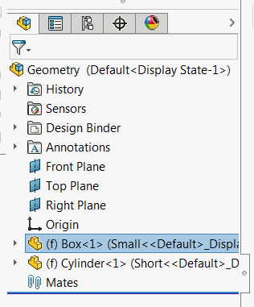

{ width=250 }

This macro copies the full path to the selected components into the clipboard using SOLIDWORKS API.

* Components can be selected in assembly or drawing document
* Components can be selected in the feature tree or in the graphics area
    * It is also possible to select a component entity (i.e. face or edge) to get the path to the component


