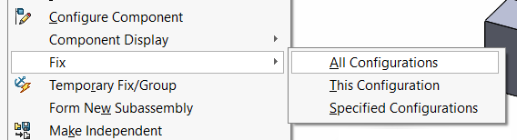
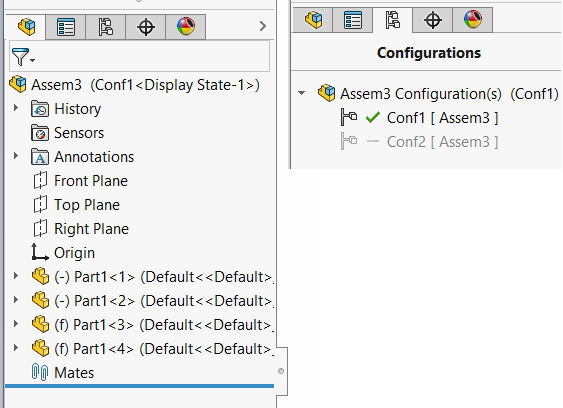
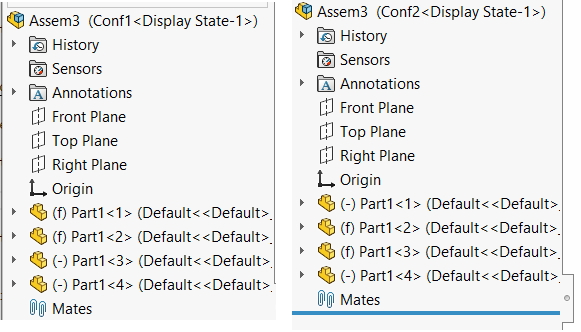

This VBA example demonstrates a simple workaround for missing SOLIDWORKS API to fix or float the component in active configuration only. [IAssemblyDoc::FixComponent](https://help.solidworks.com/2017/english/api/sldworksapi/solidworks.interop.sldworks~solidworks.interop.sldworks.iassemblydoc~fixcomponent.html) only fixes the components in all configurations.

Create an example assembly with 2 configurations and 4 instances of the component, where first 2 instances are floating in both configurations, while last 2 instances are fixed in both configuration.

As the result of running this macro components will be changed to the following result:


