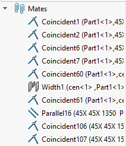

This VBA macro remove all mates from the active assembly and fixes all the top level components.

Macro allows to configure the actions to perform on the assembly by changing the values of the constants

~~~ vb
Const FIX_COMPONENTS As Boolean = True 'True to fix components, False to keep components as is
Const REMOVE_MATES As Boolean = True 'True to remove mates, False to keep mates
~~~

> Macro will fix all top level components, excluding all components which are instances of the pattern

This allows to significantly improve the performance of the assembly.


