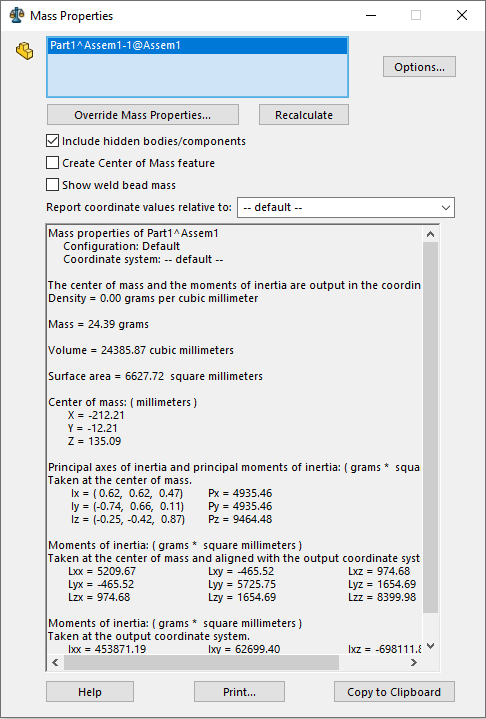

This macro demonstrates 2 approaches to find the component's center of gravity (COG) related ot assembly coordinate system.

Macro will calculate the COG for the selected component.

## Transforming the coordinates

[IModelDocExtension::GetMassProperties2](https://help.solidworks.com/2017/english/api/sldworksapi/SolidWorks.Interop.sldworks~SolidWorks.Interop.sldworks.IModelDocExtension~GetMassProperties2.html) API allows to calculate the mass properties data in the model.

When calculated on the component's model level coordinates need to be transformed into the assembly space using transforms in order to achieve the desired result.



## Using IMassProperty interface

[IMassProperty](https://help.solidworks.com/2017/English/api/sldworksapi/SOLIDWORKS.Interop.sldworks~SOLIDWORKS.Interop.sldworks.IMassProperty.html) interface emulates the functionality of Mass Property feature in SOLIDWORKS

{ width=400 }

Similarly to the UI equivalent it is possible to assign bodies (including component bodies) for the calculation scope.

One of the main benefits of this method compared to previous approach is that it is possible to calculate of COG for the lightweight components.


