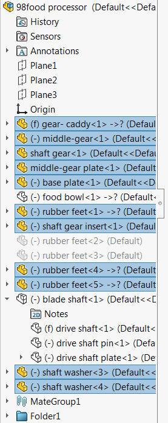

{ width=350 }

This VBA macro gets all the pointers to the visible (not suppressed and not hidden) components in the active assembly. All the components are selected using multi-select SOLIDWORKS API.

