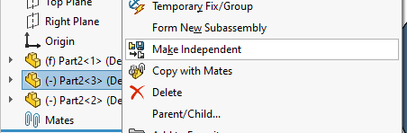

This VBA macro mimics the functionality of **Make Independent** feature of SOLIDWORKS, but will also additionally copy and rename the file associated with the copied part or assembly component.

This macro can work with a single component or multiple selected components, but all of the components must correspond to the same file.

Macro will copy the associated drawing and place it next to the target file with the same name.

## Notes

* Macro will only copy drawing which matches the name of the source file and placed in the same folder
    * To specify the subfolder of the drawings set the sub folder name in **DRAWINGS_FOLDER** constant. It is also possible to use an absolute path to specify the external drawings folder
* Macro will not overwrite the destination drawing file if already exists


