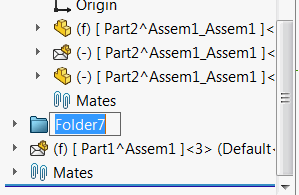

{ width=250 }

This macro allows moving the selected components into the new folder in the feature manager tree using SOLIDWORKS API.

Components (or any of their entities) can be selected in the graphics area. For example only face or edge of the component(s) can be selected for macro to work.

