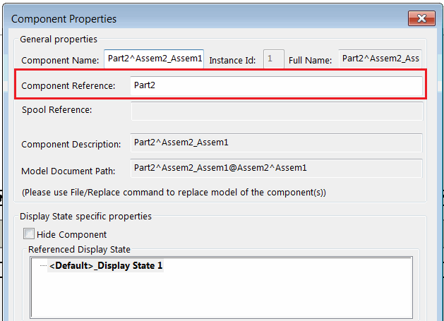
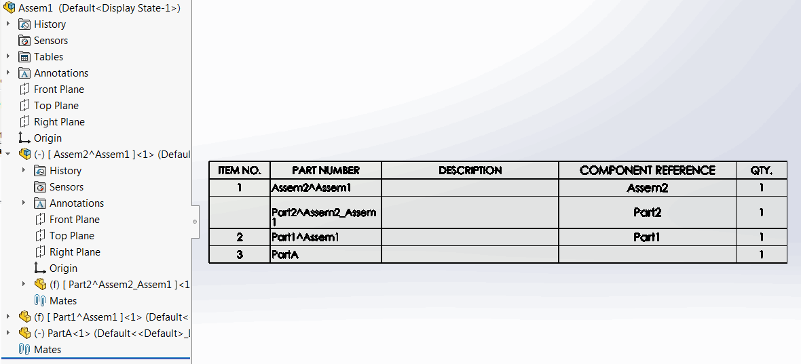

{ width=350 }

This VBA macro allows to copy the name of the components in the active assembly to the component's reference using SOLIDWORKS API.

Macro has an option to only process virtual components by settings the *VIRTUAL_ONLY* option to *True*.

~~~ vb
Const VIRTUAL_ONLY As Boolean = True
~~~

This macro can be useful if component names are used to store the project attributes (e.g. Part Number) as component name cannot be added to the Bill Of Materials while Component Reference can be.

{ width=350 }


