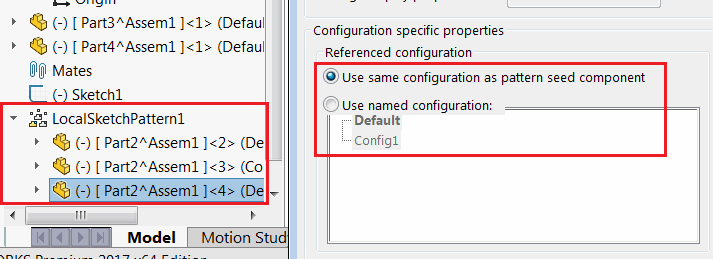

This macro example demonstrates how to change the following configuration specific properties using SOLIDWORKS API.

* Use same configuration as pattern seed component
* Use named configuration

[IAssemblyDoc::CompConfigProperties5](https://help.solidworks.com/2018/english/api/sldworksapi/solidworks.interop.sldworks~solidworks.interop.sldworks.iassemblydoc~compconfigproperties5.html) SOLIDWORKS API is used to modify the multiple properties at a time for the selected component.

In the instance component of the pattern (e.g. Sketch Driven Pattern)


