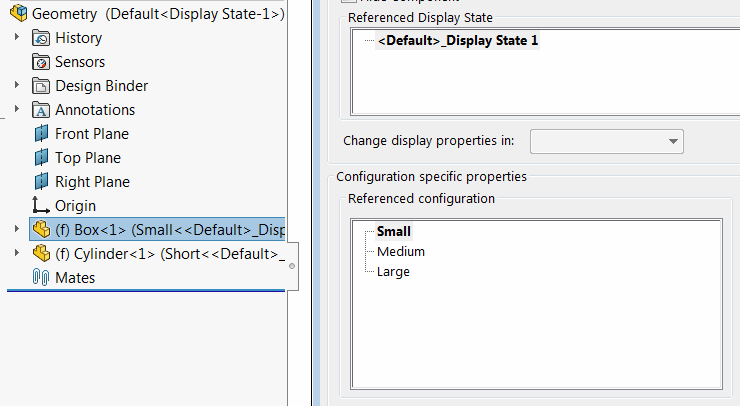

This macro generates the assemblies for each combination of top level components configurations (permutation) using SOLIDWORKS API.

{ width=450 }

Resulting combinations are saved to the external assemblies (one file per combination).

{ width=350 }

## Options
* *OUT_FOLDER* - Full path to output folder where the resulting files need to be saved

~~~ vb
Const OUT_FOLDER As String = "OUTPUT FOLDER PATH"
~~~

* *PERMUTE_ASSEMBLY_CONF* option allows to specify if the configurations of assembly need to be used in permutation or only components

~~~ vb
Const PERMUTE_ASSEMBLY_CONF As Boolean = True 'True to include assembly configurations, false to only include components
~~~

## Notes

* Original states of the components will not be restored as the result of running the macro. It is recommended to open the assembly as read only
* Total number of files equals to {number of configuration of component 1}x{number of configuration of component 2}x...x{number of configuration of component n}



