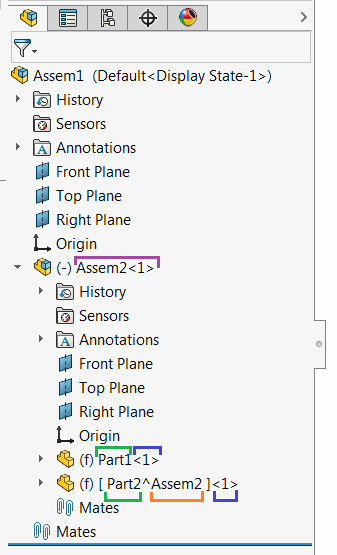

This VBA macro renames any selected components (root level, component in sub-assembly and virtual) using SOLIDWORKS API.

New name of the component is composed from the specified **SUFFIX** value

~~~ vb
Const SUFFIX As String = "_New" 'new component name will be appended with the '_New' suffix
Const PRP_NAME As String = "PartNo" 'new component name will be composed form the value of 'PartNo' custom property
~~~

If **PRP_NAME** constant is specified, name of the component will be composed from the value of this custom property. Macro will try to read this property from configuration specific property and if not specified, value will be read from file custom property.

If **PRP_NAME** constant is not specified, component base name will derive from existing component name.

## Component Name

[IComponent2::Name2](https://help.solidworks.com/2012/english/api/sldworksapi/solidworks.interop.sldworks~solidworks.interop.sldworks.icomponent2~name2.html) SOLIDWORKS API property provides get and set accessors for reading and changing the component name respectively.

This function returns different names structures when setting or getting. That means if it is required to rename component using its original name (i.e. add suffix or prefix) value returned from get-accessor needs to be altered.

When **get** accessor is called full name of the component is returned, while **set** accessor only requires short name.

Full name of the component consists of

* Component Name
* Component Index (specified after **-** symbol in full name)
* Context name for virtual component (specified after **^** symbol in the full name)
* Parent assembly full name (specified before **/** symbol in the full name)

The names of the components in the structure above will be returned as the following (the colors in the picture match the parts in names)

Assem2-1 *Root component*

Assem2-1/Part1-1 *Component in sub-assembly*

Assem2-1/Part2^Assem2-1 *virtual component in sub-assembly*


