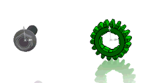
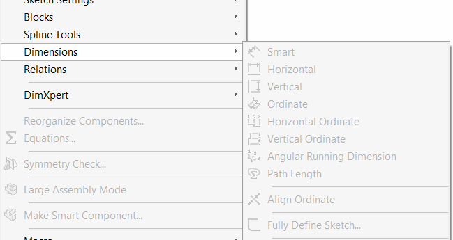

This macro demonstrates how to run a smooth animation of components rotation around Y axis of the component using the presentation transforms via [IComponent2::PresentationTransform](https://help.solidworks.com/2012/english/api/sldworksapi/solidworks.interop.sldworks~solidworks.interop.sldworks.icomponent2~presentationtransform.html) SOLIDWORKS API method.

This allows to only move the components for visual purposes without changing the geometry. Component will be moved regardless if it is fully defined in space (by mates or fix constraint). And the mates are still preserved.

* Select any component in the assembly and run the macro
* Component is rotated around its Y axis
* To stop the animation clear the selection (deselect all objects)
* To modify the speed of the rotation change the optional *speed* parameter of *RunRotationAnimation* method

~~~ vb
If Not swComp Is Nothing Then
    RunRotationAnimation swModel, swComp, 2 'speed x2
Else
    MsgBox "Please select component"
End If
~~~

### Note

In order to enable presentation mode it is required to set the [IAssemblyDoc::EnablePresentation](https://help.solidworks.com/2012/english/api/sldworksapi/SOLIDWORKS.Interop.sldworks~SOLIDWORKS.Interop.sldworks.IAssemblyDoc~EnablePresentation.html) proeprty to True.

It is required to set this property to False after the animation is finished otherwise all SOLIDWORKS menues will be locked:

{ width=300 }


