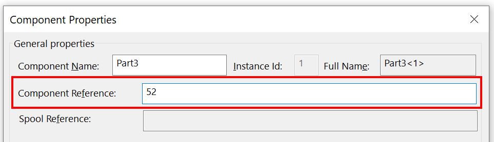

{ width=600 }

This VBA macro allows to automatically assign the numeric number to the selected components' references in the SOLIDWORKS assembly

Number is incremented automatically based on the specified seed value

Number is assigned in the order components are selected in the assembly

Component can be selected in the feature manager tree or in the graphics area (any entity of the component can be selected, e.g. face or edge)

Macro can be configured to either specify the input in the popup box (set the value of **INPUT_SEED** variable to **True**) or by providing the seed as the constant (**INPUT_SEED** equals to **False** and **SEED** equals to the seed number)

~~~ vb
Const INPUT_SEED As Boolean = True 'input the seed (start) number in the input box upon running the macro
Const SEED As Integer = 1
~~~