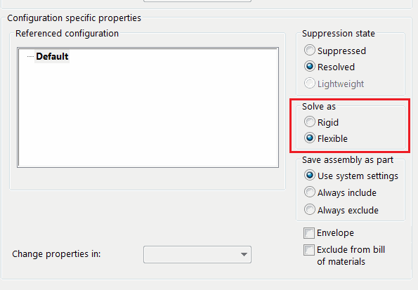

User can change the solving options (rigid or flexible) for assembly components using components options page or toolbar command. This is however only limited for one component at a time.

This VBA macro allows to set either rigid or solved options for all selected components as one command using SOLIDWORKS API.

Specify the option as follows:

~~~ vb
Const SET_FLEXIBLE As Boolean = True 'True - set to flexible, False - set to Rigid
~~~


