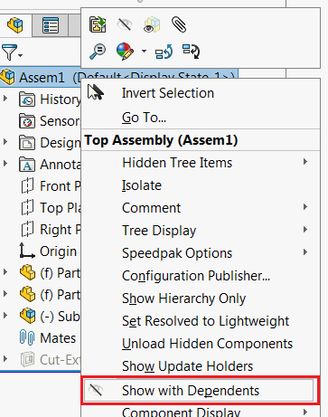

{ width=250 }

This example demonstrates how to call the 'Show With Dependents' command for components or assembly to show all components at once using SOLIDWORKS API and Windows API.

Macro will call the command for the selected component or for the assembly (if no components selected).

