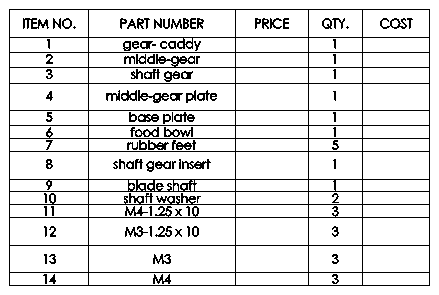
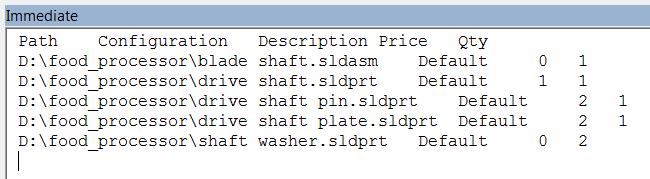

{ width=250 }

This example demonstrates how to compose flat (top level only) Bill Of Materials table from the assembly tree using SOLIDWORKS API.

Bill Of Materials position includes the following columns:

* Model Path
* Model Configuration
* Description (custom property)
* Price (custom property)
* Quantity (calculated)

The composed BOM is output to the immediate window of VBA editor:

{ width=250 }

It is not required to have a BOM Table inserted for this macro to work.


