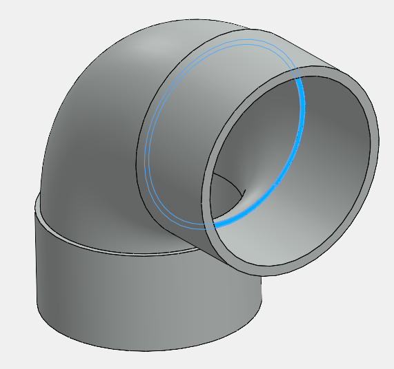
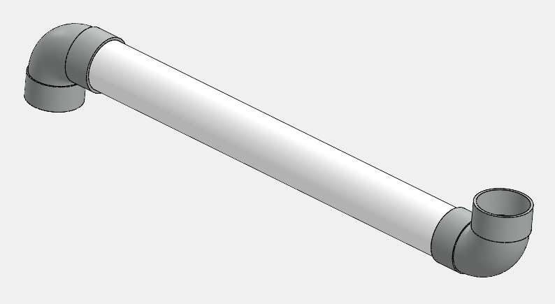

This VBA macro inserts new virtual component into SOLIDWORKS assembly between the selected stop faces of the 2 fittings

{ width=400 }

Stop faces must be planar with 2 circular edges. Edges between 2 fittings must be concentric.

Macro will perform the following steps:

* Create new virtual component based on the first stop face.
* Create new sketch on the first stop face
* Convert both edges of the stop face into the sketch
* Extrude the sketch up to the second stop face
* Assign the material based on the **MATERIAL_NAME** variable
* Close virtual component

{ width=400 }

As the result pipe with adjustable inner and outer diameter and length is created. Changing the position or size of the fitting will change the geometry of the pipe automatically.


