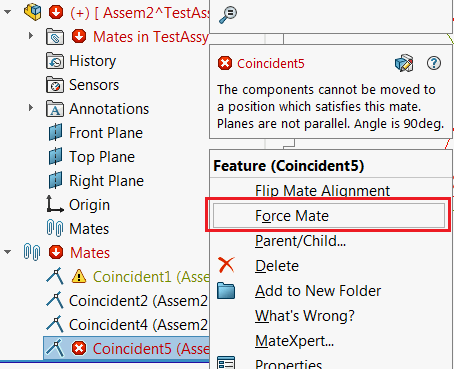

{ width=350 }

This example demonstrates how to run 'Force Mate' command for the mate with rebuild errors in order to solve the constraint. This macro is based on combination of Windows and SOLIDWORKS API.


