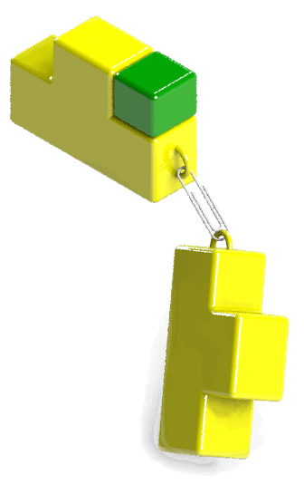

{ width=200 }

Assembly components can be mated programmatically via [IAssemblyDoc::AddMate3](https://help.solidworks.com/2012/english/api/sldworksapi/SOLIDWORKS.Interop.sldworks~SOLIDWORKS.Interop.sldworks.IAssemblyDoc~AddMate3.html) SOLIDWORKS API method (or newer versions of this method).

It is required to mark the selected objects with different marks for the different mate types. Please refer the SOLIDWORKS API help documentation for the values of marks for a specific mate or use SOLIDWORKS macro recorder to capture the correct mark.
