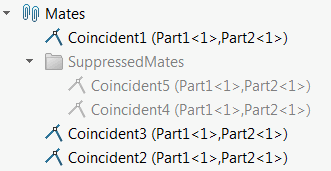

{ width=250 }

This VBA macro allows to move all suppressed mates to a nominated feature manager folder using SOLIDWORKS API. Macro will create folder if it doesn't exist or move to already existing one.

Macro will also move all unsuppressed mates of the folder if exist.

To configure the folder name, change the value of the *FOLDER_NAME* variable:

~~~ vb
Const FOLDER_NAME As String = "<Folder Name>"
~~~


