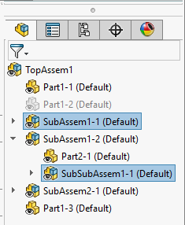
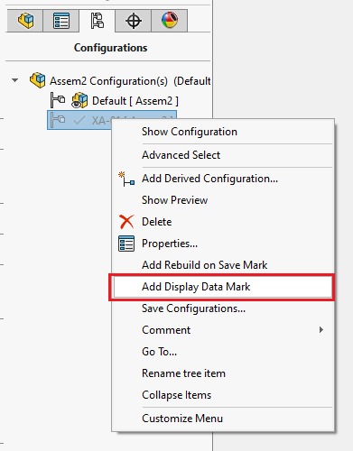
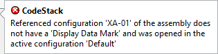

This VBA macro can be run from the assembly opened in the Large Design Review (LDR) mode. Macro will open all selected components in their own windows, but unlike out-of-the-box functionality assemblies will not be resolved and will preserve the LDR mode.

It is then possible to enable the editing in the LDR mode, modify the assembly and update the graphics in the top level assembly.

Preserving the LDR mode on all the steps will significantly improve the performance.

## Notes and limitations

* Sub-assembly components will be opened in Large Design Review mode while part components will be opened in the View Only mode
* If target parts or assemblies do not have display data stored - error will be thrown
* Components must be selected from the Feature Manager Tree. Entities selected in the graphics area will be ignored
* This VBA macro is using the simplified version of the [Search Routine for Referenced Documents](https://help.solidworks.com/2016/english/SolidWorks/sldworks/c_Search_Routine_for_Referenced_Documents.htm) and only checks active assembly's folder and sub folders before falling back on the cached path of the component. In some cases this may result in incorrect reference loaded (e.g if search folders are used). But this will only apply to the assembly which was copied and cached file paths were never updated.

### Referenced Configurations

This macro will attempt to open the assembly in the referenced configuration of the component, however by default SOLIDWORKS only stores the display data in the active configuration, unless configurations are marked with 'Display Data Mark' flag

{ width=250 }

If the referenced configuration of the component is not marked with the above flag and it is not an active configuration, then it cannot be loaded in Large Design Review. In this case macro will load the default configuration and display the below warning indicating that the graphics of different configuration is loaded.

