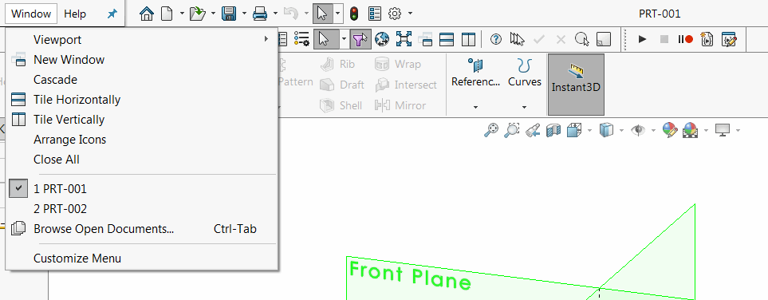
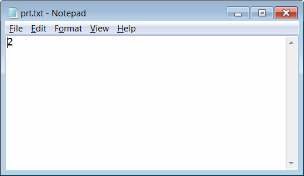

{ width=450 }

This VBA macro automatically increments the part number and sets this as a title for newly created file using SOLIDWORKS API.

Part number is incremented and stored in the external text file which can be shared across different users if needed.

{ width=350 }

Macro provides several options to format the title which can be modified by changes in the values of the constants in the macro.

~~~ vb
Const NMB_SRC_FILE_PATH As String = "D:\prt.txt" 'path to store the current part index
Const NMB_FORMAT As String = "000" 'padding for the number, e.g. 001, 002, instead of 1, 2
Const BASE_NAME As String = "PRT-" 'Base prefix for file naming
~~~

Follow the video tutorial in the [Run Macro On Document Load](solidworks-api/application/documents/handle-document-load/) article for the guide of running this macro automatically for each newly created model.


