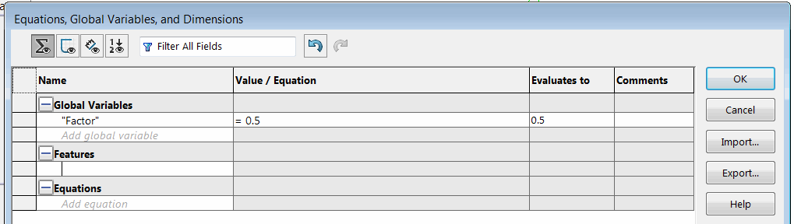

This example demonstrates how to modify the value of the named global variable in the equation manager using SOLIDWORKS API.

Change the name of the variable and the value constants in the head of the macro.


