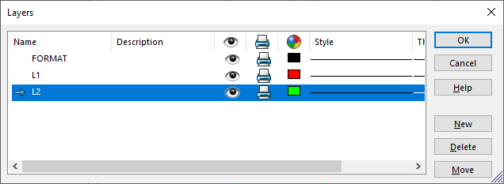

This VBA macro collects and removes all items on the specified layer (annotations, sketch segments, blocks, sketch points and hatch). Layer itself is not removed.

Set the name of the layer in **LAYER_NAME** constant.

