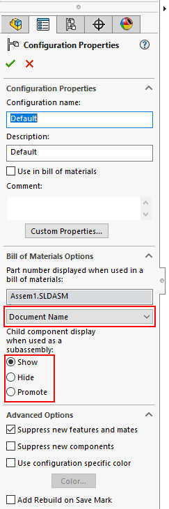

This VBA macro allows to change the options of the configuration regarding the processing in the Bill Of Materials

* Part Number Source
    * Configuration name
    * Document name
    * Parent name
* Children Components Display
    * Show
    * Hide
    * Promote

Macro can process active configuration only or all configurations

Configure the macro by changing its constants

Specify -1 for **PART_NUMBER_SRC** or **CHILD_COMPS_DISP** options to keep original values or new value to override

~~~ vb
Const ALL_CONFIGS As Boolean = True 'True to process all configurations, False to process active configuration only
Const PART_NUMBER_SRC As Integer = swBOMPartNumberSource_e.swBOMPartNumber_ConfigurationName 'Part number source: -1 to keep as is or swBOMPartNumberSource_e.swBOMPartNumber_ConfigurationName, swBOMPartNumberSource_e.swBOMPartNumber_DocumentName or swBOMPartNumberSource_e.swBOMPartNumber_ParentName
Const CHILD_COMPS_DISP As Integer = swChildComponentInBOMOption_e.swChildComponent_Promote 'Display of components in BOM: -1 to keep as is or swChildComponentInBOMOption_e.swChildComponent_Show, swChildComponentInBOMOption_e.swChildComponent_Hide or swChildComponentInBOMOption_e.swChildComponent_Promote
~~~

