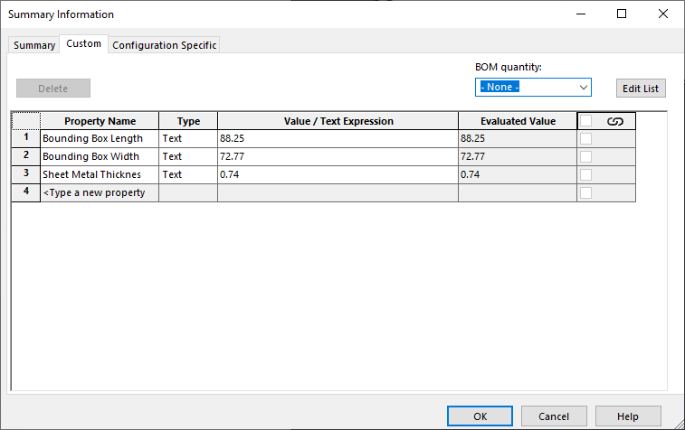
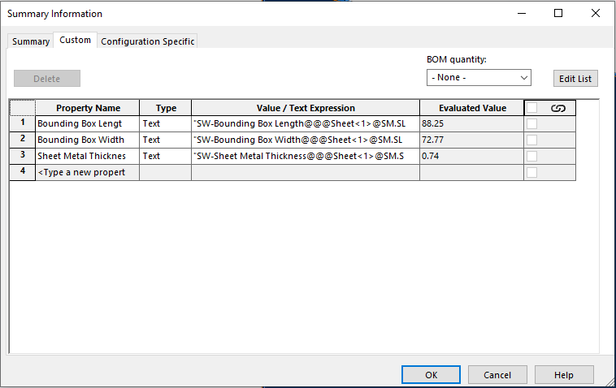

This VBA macro copies the specified or all SOLIDWORKS custom properties from the sheet metal or weldment cut-list item to model or configuration.

Properties from the first found cut-list will be copied.



## Configuration

Macro can be configured by changing the constants

~~~ vb
Const ALL_CONFS As Boolean = False 'True to process all configurations
Const PROCESS_TOP_LEVEL_CONFIGS As Boolean = False 'True to process top level configurations
Const PROCESS_CHILDREN_CONFIGS As Boolean = True 'True to process children configurations
~~~

### Properties Scope

*CONF_SPEC_PRP* constant sets the target properties scope.

* True to copy properties to configuration specific tab
* False to copy to Custom tab

### Properties Source

*COPY_RES_VAL* constant sets the property source

* True to copy resolved values
    
 { width=500 }

* False to copy expressions

 { width=500 }

### Properties List

~~~ vb
Dim SRC_PROPERTIES As Variant
Dim TARG_PROPERTIES As Variant
~~~

*SRC_PROPERTIES* array contains list of property names to copy, *TARG_PROPERTIES* array contains list of properties to copy to
    
Copy specified properties

~~~ vb
Sub Init(Optional dummy As Variant = Empty)
    SRC_PROPERTIES = Array("Prp1", "Prp2", "Prp3") 'Copy Prp1, Prp2, Prp3
    TARG_PROPERTIES = Array("TargPrp1", "Prp2", "TargPrp3") 'Copy to TargPrp1, Prp2, TargPrp3
End Sub
~~~

Copy all properties

~~~ vb
Sub Init(Optional dummy As Variant = Empty)
    SRC_PROPERTIES = Empty
    TARG_PROPERTIES = Empty
End Sub
~~~