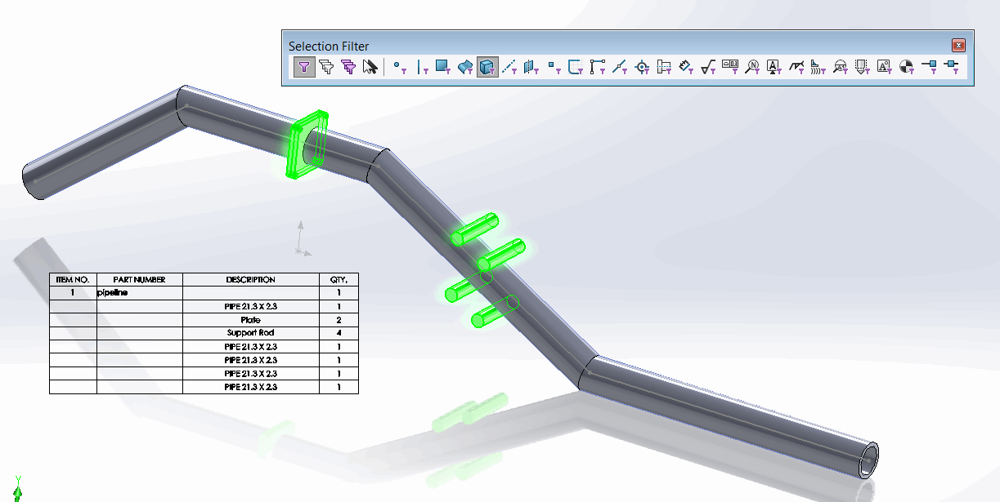

{ width=300 }

This macro allows to exclude the selected bodies from the weldment or sheet metal cut list using SOLIDWORKS API.

Bodies can be selected in the graphics view or feature tree which makes the process easier as it is not required to find the corresponding cut-list feature to exclude the body.

It is possible to use [selection filters](http://help.solidworks.com/2013/english/solidworks/sldworks/r_selection_filter_selection.htm) for bodies to simplify the picking of required ones from the graphics area.

It is also possible to select face, edge or vertex of the body to be excluded.

{ width=500 }


