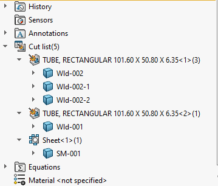

This VBA macro allows to rename all bodies which belong to cut-list folder (e.g. Sheet Metal or Weldment) based on the predefined naming template. It is possible to use free text in combination with custom property placeholder which will allow to use custom property in the name.

Custom property must be enclosed within ```<>``` symbols

For example to rename all sheet metal bodies using **SM_** prefix followed by value of the thickness, **NAME_TEMPLATE** variable should be defined as:

~~~ vb
Const NAME_TEMPLATE As String = "SM_<Thickness>"
~~~

## Notes

* Macro may require model rebuild after the run to refresh the names of the features
* If several bodies reside within one cut-list folder, index will be used to differentiate the names, e.g. -1, -2, -3
* Macro will perform the cut-list update before renaming

