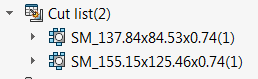
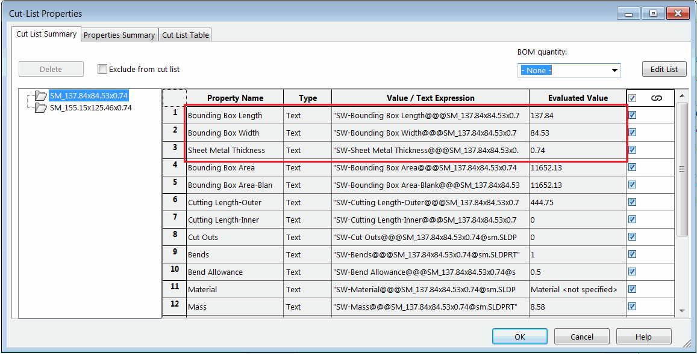

{ width=250 }

This VBA macro allows to rename all cut list features for weldment and sheet metal part based on the name template which can include values of file and cut-list custom properties, file name, configuration name and free text.

{ width=550 }

To configure the macro modify the values of *NAME_TEMPLATE*, *INDEX_FORMAT* and *ALWAYS_ADD_INDEX* constants

*NAME_TEMPLATE* can contain free text and placeholders which will be dynamically replaced by corresponding custom properties values

The following placeholders are supported

<_FileName_> - name of the part file (without extension) where the cut-list resides in
<_ConfName_> - name of the active configuration of the part file
<$CLPRP:[PropertyName]> - any name of the cut-list property to read value from, e.g. <Thickness> is replaced with the value of cut-list custom property Thickness
<$PRP:[PropertyName]> - any name of the custom property of part to read value from, e.g. <PartNo> is replaced with the value of cut-list custom property PartNo

Placeholders will be resolved for each cut-list at runtime.

*INDEX_FORMAT* constant allows to specify the padding of the index for feature name if name is used. By default feature names resolved to the same value will have an index for second feature and so on, unless *ALWAYS_ADD_INDEX* constant is set to true. In this case first feature will have index as well.

For example the following setup (in case part PartNo equals to ABC) will resolve cut-list feature to *ABC_001*, *ABC_002*, *ABC_003* etc.

~~~ vb
Const NAME_TEMPLATE = "<$PRP:PartNo>_"
Const INDEX_FORMAT As String = "000"
Const ALWAYS_ADD_INDEX As Boolean = True
~~~

Watch [video demonstration](https://youtu.be/jsjN8zNRTuc?t=200)


