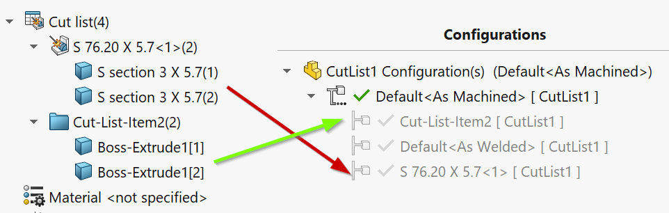
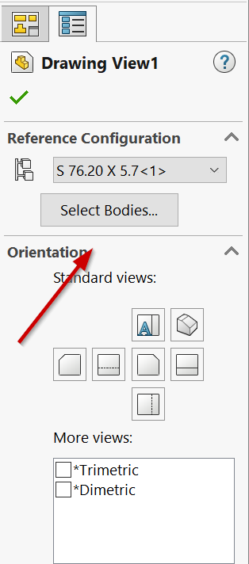

This VBA macro creates individual configuration for all cut-list bodies of the active part document.

This macro can be useful when preparing drawings for multi-body cut-list parts where drawing is required for each unique body.

Macro will create as many configurations as cut-lists feature in the document and will add the corresponding **Delete Body** feature and setup the suppression of this feature so each configuration will only display the body of the single cut-list.

Macro will name the configuration after the cut-list name.

**KEEP_ALL_CUT_LIST_BODIES** constant allows to control should the macro isolate all cut-list bodies or only keep a single unique body.

~~~ vb
Const KEEP_ALL_CUT_LIST_BODIES As Boolean = True 'keep all cut-list bodies
~~~

If **KEEP_ALL_CUT_LIST_BODIES** is set to **False** only first body of each cut-list will be kept. This simplifies the drawing creation process as it is only required to select the corresponding referenced configuration to display body on drawing. However this will result in incorrect quantity of the cut-list item if BOM table is inserted (will always be equal to 1).

If **KEEP_ALL_CUT_LIST_BODIES** is set to **True** all bodies of each cut-list will be kept. in this case user is additionally required to select the single body to keep in the drawing via **Select Body** button in the drawing view. However in this case Bill Of Materials table will display the correct quantity.

