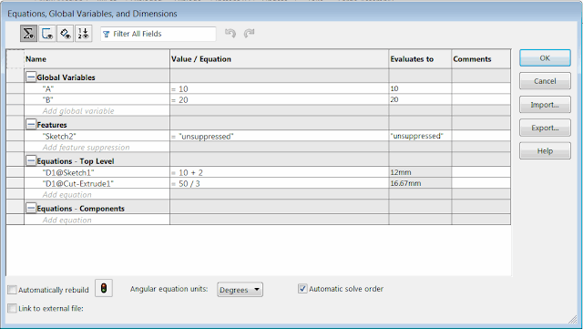
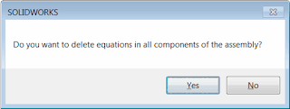

This macro removes all of the equations (or optionally only broken equations) in the active model (part or assembly) using SOLIDWORKS API.

{ width=640 }

If active model is assembly, macro optionally allows to remove all equations from each component of the assembly. The following message will be displayed. Click **Yes** to remove equations from all components on all levels and **No** to only process equations of the top level assembly.

{ width=320 height=120 }

Set the *DELETE_BROKEN_ONLY* option to *True* in order to only remove the broken (dangling) equations.

**IMPORTANT: Use this macro on your own risk. This macro modifies your data (deletes all equations) please backup your file before running this macro**


