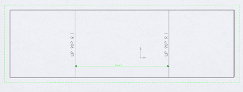

This example demonstrates how to add dimensions to bend lines in the drawing view of sheet metal flat pattern using SOLIDWORKS API.

{ width=400 height=150 }

It is required to select the sketch lines using the select data object with the view assigned, otherwise the dimensions creating will fail.

[IModelDoc2::AddDimension2](http://help.solidworks.com/2018/english/api/sldworksapi/solidworks.interop.sldworks~solidworks.interop.sldworks.imodeldoc~adddimension2.html) SOLIDWORKS API is used to add the dimension. Dimension is positioned at (0, 0, 0) coordinate. Refer the [Dimension Visible Entities](/solidworks-api/document/drawing/view-dimension-drawing-entities/) example for code snippet for calculating the optimal dimension position.


