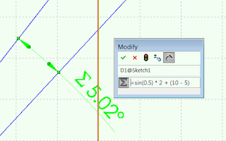

This example will modify the value of the selected dimension and sets its value to be equal to the equation using SOLIDWORKS API:

> sin(0.5) * 2 + (10 - 5)

{ width=320 height=200 }

[IEquationMgr](http://help.solidworks.com/2018/english/api/sldworksapi/SolidWorks.Interop.sldworks~SolidWorks.Interop.sldworks.IEquationMgr.html) SOLIDWORKS API interface should be used to manage equations in SOLIDWORKS document.


