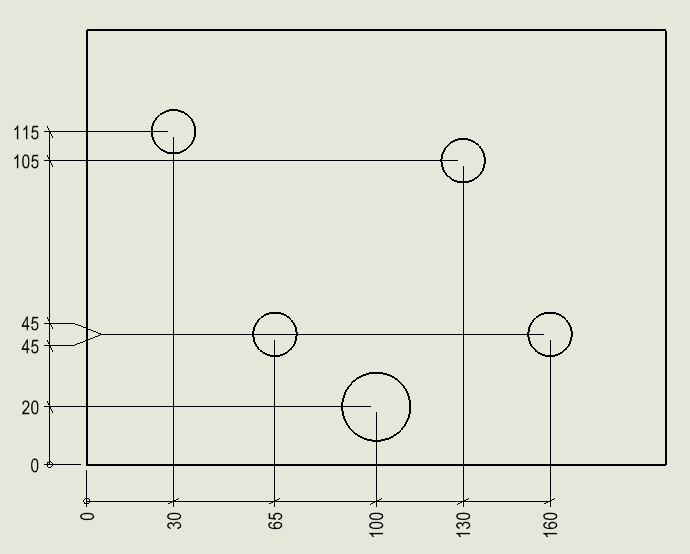

This SOLIDWORKS VBA macro automates adding the horizontal ordinate dimensions for all the holes in the selected drawing view.

* Macro will find the ordinate dimension origin by finding the bottom left vertex in the view
* Macro will find all holes of the view (only internal holes are included, fillets will not be considered)
* Macro will add horizontal and vertical dimensions for the holes
* Dimensions wil be positioned relative to the drawing view

