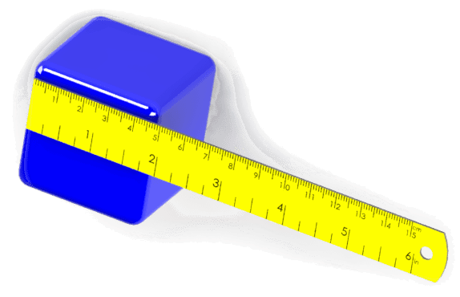

{ width=300 }

Dimensions can be added to the selected sketch segments via [IModelDocExtension::AddDimension](http://help.solidworks.com/2015/english/api/sldworksapi/solidworks.interop.sldworks~solidworks.interop.sldworks.imodeldocextension~adddimension.html) SOLIDWORKS API method.

Each dimension has a unique name which can be assigned by the user. Dimension object can be retrieved by name via [IModelDoc2::Parameter](http://help.solidworks.com/2012/english/api/sldworksapi/solidworks.interop.sldworks~solidworks.interop.sldworks.imodeldoc2~parameter.html) method. 

Refer the [IDimension](http://help.solidworks.com/2012/english/api/sldworksapi/SolidWorks.Interop.sldworks~SolidWorks.Interop.sldworks.IDimension.html) SOLIDWORKS API interface for the list of available methods for dimensions automation.
